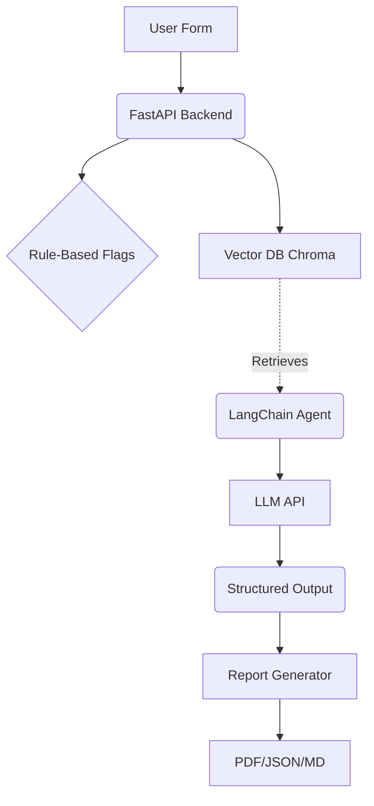

# AI Governance Risk Classifier

A RAG-based compliance decision-support tool that evaluates AI use cases against regulatory frameworks like the EU AI Act and GDPR.


## Overview

This tool helps compliance teams assess the regulatory risks of new AI systems. It uses Retrieval-Augmented Generation (RAG) to ground its analysis in official policy documents, ensuring that every classification is traceable and audit-ready.

**Key Features:**
- **Risk Classification**: Classifies systems into Prohibited, High Risk, Limited Risk, or Minimal Risk.
- **Compliance Flags**: Identifies specific concerns (Privacy, Fairness, Transparency, Oversight).
- **Grounded Reasoning**: Retrieves actual regulatory text to justify its conclusions.
- **Audit-Ready Reports**: Exports assessments to PDF, JSON, and Markdown.
- **Evaluation Pipeline**: Compare RAG performance against a standard LLM baseline using a labeled dataset.

> [!WARNING]
> This is a decision-support prototype. It does not constitute legal advice. High-risk systems require formal legal review.

---

## Architecture



**Tech Stack:**
- **Backend:** Python, FastAPI, LangChain, Pydantic, ChromaDB
- **Frontend:** React, Vite, Tailwind CSS, Lucide Icons

---

## Setup Instructions

### Prerequisites
- Python 3.10+
- Node.js 18+

### 1. Backend Setup
```bash
cd backend
python -m venv venv
# Windows: venv\Scripts\activate
# Mac/Linux: source venv/bin/activate
pip install -r requirements.txt
```

Create a `.env` file in the root based on `.env.example`:
```
OPENAI_API_KEY=your-sk-key-here
OPENAI_MODEL=gpt-4o-mini
```
*(If you don't provide an API key, the system will gracefully fall back to a rule-based mock classifier.)*

Start the backend:
```bash
uvicorn main:app --reload
```

### 2. Frontend Setup
```bash
cd frontend
npm install
npm run dev
```
Open `http://localhost:5173` in your browser.

---

## Usage Guide

1. **Ingest Regulations**: Go to the **Documents** page and click "Run Ingestion Pipeline". This will parse, chunk, and embed the sample EU AI Act and GDPR texts from the `data/` folder into the local ChromaDB vector store.
2. **Assess a Use Case**: Go to the **New Assessment** page. Fill out the form describing an AI system (e.g., an automated resume screener). Add checks for personal data or automated decisions.
3. **View Results**: The system will output a risk level, compliance flags, and specific regulatory citations.
4. **Export**: Use the JSON or Markdown export buttons at the bottom of the result card.
5. **Evaluate**: Go to the **Evaluation** page to run the 20-case dataset through the pipeline and compare accuracy with and without RAG retrieval.

---

## Example Dataset Cases

The `data/datasets/evaluation_dataset.json` includes 20 examples for testing, including:
- 🔴 Facial Recognition in Public Spaces (Prohibited/Unacceptable Risk)
- 🟠 AI Recruitment Screening Tool (High Risk)
- 🟡 Customer Support Chatbot (Limited Risk)
- 🟢 Smart Inventory Management System (Minimal Risk)

## Limitations and Future Work
- **Static Taxonomy**: Currently relies on a YAML config. Future versions should support UI-based taxonomy editing.
- **Citations**: Citations point to document sections. PDF coordinate mapping could be added to highlight exact paragraphs in the source files.
- **Authentication**: Currently lacks multi-tenant auth and RBAC for enterprise deployment.
